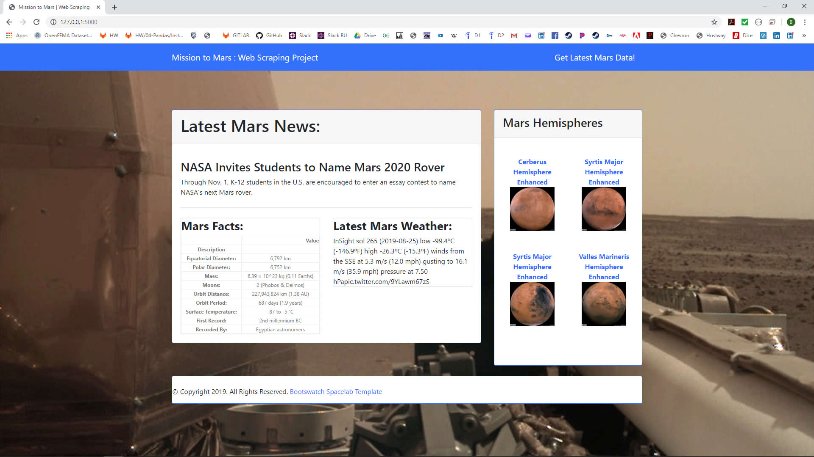

# Mission-to-Mars
Mission to Mars: In this assignment, I built a web application that scrapes various websites for data related to the Mission to Mars and displays the information in a single HTML page. 

## Technology Utilized

   - Python
   - Jupyter NoteBooks
   - Flask 
   - MongoDB
   - Adobe Dreamweaver
   - Adobe Fireworks CS6
   - Adobe Premiere Rush
   - Bootstrap ( https://bootswatch.com/spacelab/ )
   
   
   
   
## Data Sources
  - NASA Mars News - ( https://mars.nasa.gov/news/ )
  - JPL Mars Space Images - Featured Image - ( https://www.jpl.nasa.gov/spaceimages/?search=&category=Mars ) 
  - Mars Weather - ( https://twitter.com/marswxreport?lang=en )
  - Mars Facts - ( https://space-facts.com/mars/ )
  - Mars Hemispheres - USGS ( https://astrogeology.usgs.gov/search/results?q=hemisphere+enhanced&k1=target&v1=Mars )
  	- due to the fact that this site is now a Error 404. I uploaded the pictures to http://www.labellelube.com/mars.html on my own site to scrape.

  
# Note The JPL Mars Space Featured Image is the background website picture.
	

_________________________________________________________________________________

## Submission

https://brianlabelle.github.io/MarsHTML/

https://github.com/BrianLabelle/Mission-to-Mars

- - -

© 2019 Rice Cookers | Brian Labelle | Sous-Coding Chef
